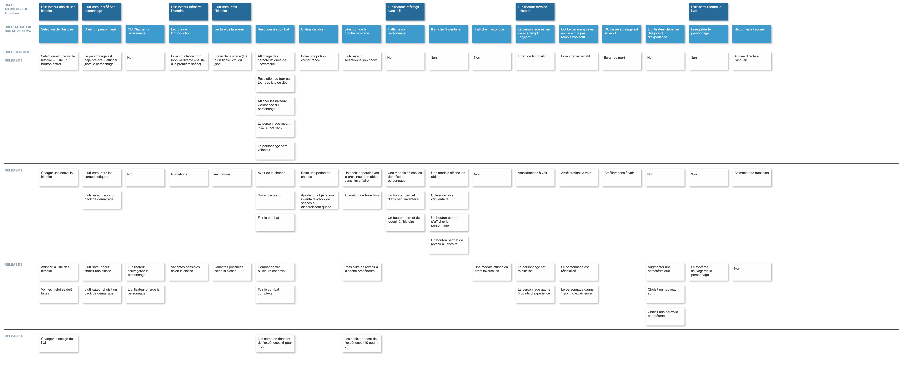

# README

## Le projet

Je cherche à écrire des histoires interactives en utilisant les règles simples des Livres dont Vous Êtes le Héro.

MISTRAL : <https://chat.mistral.ai/chat/6686cf8a-3088-4ea4-b4d1-e87d7501805d>

Voir la doc :

- [Principes de la doc](docs/README.md)
- [Utilisation de github](docs/github.md)
- [L'environnement de React Native](docs/react-native-env.md)
- [L'architecture](docs/architecture.md)

## Version #1

### L'utilisateur choisit une histoire

- Sélection de l'histoire X
  - Sélectionner une seule histoire = juste un bouton entrer X

### L'utilisateur créé son personnage

- Créer un personnage X
  - Le personnage est déjà pré-tiré = afficher juste le personnage X

### L'utilisateur démarre l'histoire

- Lecture de l'introduction X
  - Ecran d'introduction (on va directe ensuite à la première scène) X

### L'utilisateur fait l'histoire

- Lecture de la scène X

  - Ecran de la scène (tiré d'un fichier xml ou json) X

- Résoudre un combat

  - ​ Affichage des caractéristiques de l'adversaire X

  - ​ Résolution au tour par tour des jets de dés X

  - ​ Afficher les niveaux vie/chance du personnage X

  - ​ Le personnage meurt -> Ecran de mort

  - ​ Le personnage sort vainceur

- ​ Utiliser un objet X

  - Boire une potion d'endurance X

- Sélection de la prochaine scène X
  - L'utilisateur sélectionne son choix X

### L'utilisateur termine l'histoire

- Le personnage est en vie et a remplit l'objectif

  - Ecran de fin positif

- OU Le personnage est en vie et n'a pas remplit l'objectif

  - Ecran de fin négatif

- OU Le personnage est en mort
  - Ecran de mort

### L'utilisateur ferme le livre

- Retourner à l'accueil
  - Arrivée directe à l'accueil
